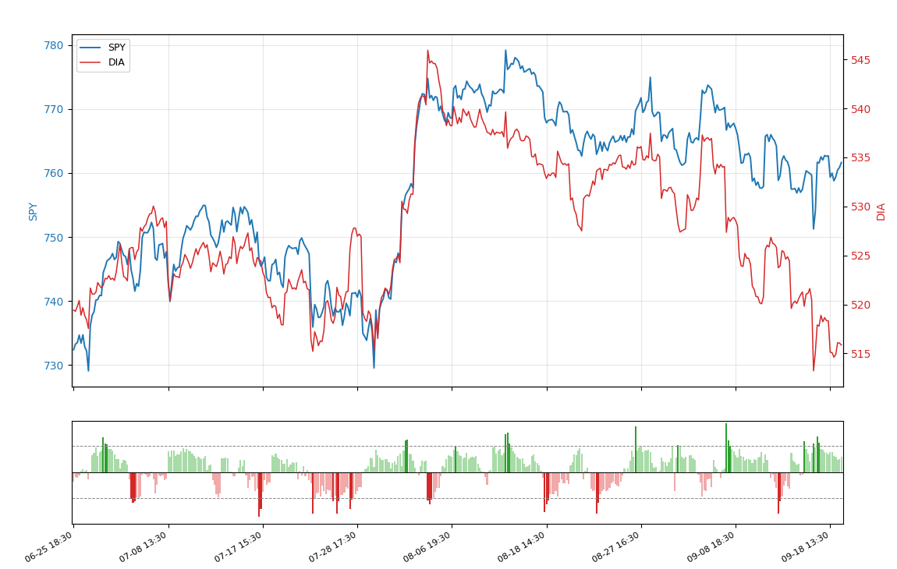

# PairMonitor

PairMonitor is designed to explore an interesting question in quantitative trading:

> **Can statistical methodologies identify useful relationships across different market instruments, and reveal relative-value opportunities that single-price analysis cannot capture?**

I am currently focuseing on US stocks and ETFs but will expand to multi-market instruments.

It combines unsupervised clustering for pair discovery, statistical models for spread analysis, relative-value monitoring, and a Telegram bot that automatically tracks selected relationships.

This repository *documents the main research ideas* and provides price-spread-based indicator behind PairMonitor.

It is **not the full production codebase used by the live bot**.

## Why I built it

Finding a useful comparison instrument is not always straightforward.

Two stocks from the same sector can behave very differently. At the same time, instruments from different classifications can sometimes show stronger statistical relationships.

This led me to explore whether **unsupervised clustering can narrow a large market universe into more meaningful comparison candidates** and what **statistical models can identify mispricing opportunities more effectively**.


## Research workflow

```text
Market Universe
      ↓
Feature Construction
      ↓
Unsupervised Clustering
      ↓
Candidate Pairs
      ↓
Pair-Level Statistical Analysis
      ↓
Relative-Value Monitoring
      ↓
Alerts / Research Context
```

Clustering is only used to **identify possible candidates**.

It does not prove that two instruments form a meaningful or stable pair.

Some of the characteristics I currently study include:

* historical co-movement,
* correlation,
* residual behaviour,
* mean reversion,
* relative momentum,
* sector context,
* and relationship stability over time.

The objective is to understand whether a relationship contains useful relative-value information rather than simply showing short-term correlation.

## Public examples

The production PairMonitor system will remain private.

However, I plan to share small and understandable examples of the main statistical ideas used in the research.

### Price Spread

The first public example is:

[`src/pair_spread_viewer.py`](src/pair_spread_viewer.py)

The script:

* downloads recent hourly prices,
* aligns two instruments,
* calculates their log-price spread,
* normalizes the spread using a rolling Z-score,
* and highlights observations that are relatively extreme compared with recent history.



You can also try the indicator on Tradingview via [`src/pair_spread_indicator_pinescript`](src/pair_spread_indicator_pinescript)


The simplified calculation is:

```text
Spread = log(Target Price) - log(Comparison Price)

                  Spread - Rolling Mean
Z-Score = -----------------------------------
                  Rolling Standard Deviation
```

A large positive or negative Z-score means the current spread is unusual relative to its recent history.

It does **not** automatically imply mean reversion, mispricing, or a trading opportunity.

### Planned examples

I also plan to add:

```text
Price Spread — Python
Price Spread — Pine Script
```

These public examples will focus on the statistical concepts rather than reproducing PairMonitor's complete signal-generation logic.

## Residual spread

Another area I am researching is regression-based residual analysis.

The basic idea is:

```text
Target
   ↓
Regression against comparison instrument
   ↓
Estimated relationship
   ↓
Observed Target - Model Estimate
   ↓
Residual
   ↓
Standardized Residual Behaviour
```

Instead of comparing two prices directly, the regression estimates how the target usually behaves relative to the comparison instrument.

The residual then measures how far the observed target price deviates from that estimated relationship.

This provides another way to study whether one instrument is behaving unusually relative to another.

## Telegram bot

The research eventually developed into a Telegram bot that monitors selected relationships automatically.

The bot currently provides:

* relative-value alerts,
* pair charts,
* signal context,
* watchlists,
* and on-demand pair analysis.

Using signals for Meta from 22 Sep 2026 back to 18 Sep 2026 as an example here:


The bot is currently running as a **limited trial**:

[Open PairMonitorBot](https://t.me/PairResearchBot)

It runs independently on lightweight cloud infrastructure.

The bot should be viewed as an active research environment rather than a production-grade financial service.

## What a signal means

A PairMonitor signal is intended to mean:

> **The relationship between two instruments currently looks statistically unusual enough to investigate further.**

It give score of the unusual pair relationship based spread volaitltiy but does not imply guaranteed mean reversion, future direction, or a buy or sell recommendation. *The signal is simply a way to identify relationships that may deserve closer analysis.*

## What remains private

The live PairMonitor system contains additional research and production logic that is not included in this repository.

This includes:

* production pair ranking,
* the full clustering workflow,
* signal classification,
* quality scoring,
* threshold calibration,
* multi-timeframe context,
* and Telegram infrastructure.

The goal of this repository is to make the research ideas understandable and reproducible without turning the public version into a copy of the production system.

## Run the Python example

Install the required dependencies:

```bash
pip install yfinance pandas numpy matplotlib
```

Run:

```bash
python src/pair_spread_viewer.py
```

Example:

```text
Target: SPY
Compared: DIA


```

## Current research questions

There are still several questions I am exploring:

* Can clustering actually improve pair discovery?
* What statistical models other than residual from beta can be applied?
* How we can optimize the threshold parameters to identify a better extreme level of the relationship between a pair
* How much historical stability should be required before monitoring a pair?

These questions are still part of the research process rather than settled conclusions.

Feedback, technical discussion, and alternative approaches are welcome.

## Disclaimer

PairMonitor is a personal quantitative research and educational project.

Nothing in this repository or the associated Telegram bot constitutes financial advice, an investment recommendation, or a representation of future performance.

Statistical relationships can weaken, change, or disappear completely. Historical relationships do not guarantee future behaviour.
